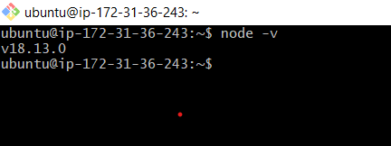

installing nodejs application on ubuntu
---------------------------------------
1. manual steps to install nodejs

```
sudo apt update -y
curl -sL https://deb.nodesource.com/setup_18.x | sudo -E bash -
sudo apt install nodejs
node -v

```
2. refer here for the manual steps installation link [refer here](https://linuxize.com/post/how-to-install-node-js-on-ubuntu-22-04/)
3. refer here for the playbook [refer here](https://github.com/nkishore555/joip_docs_QT/blob/main/Ansible/Nodejs/nodejs.yml)
4. nodejs version image refer here 